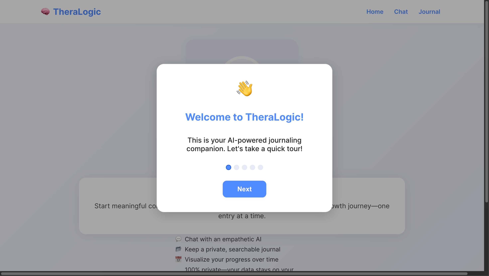
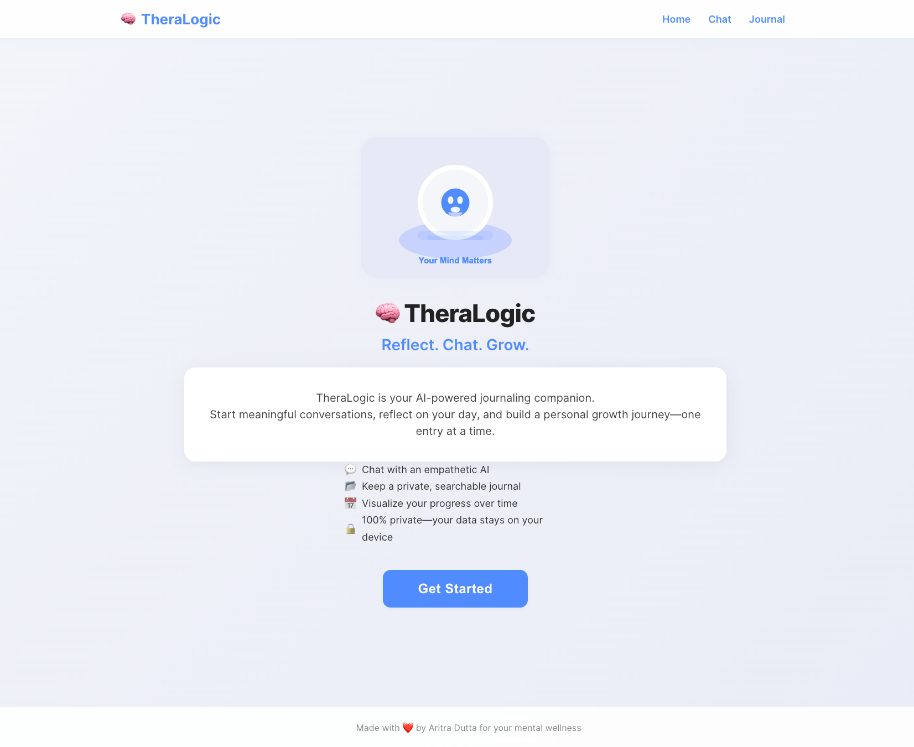
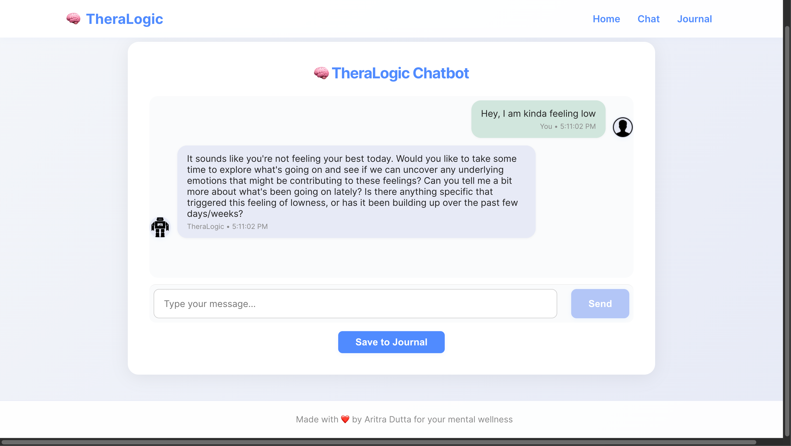
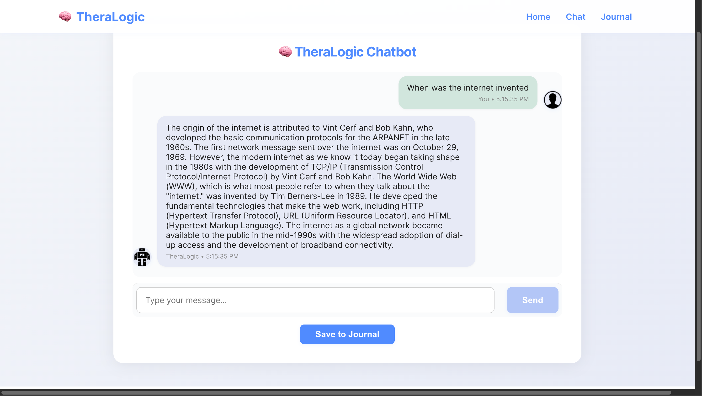
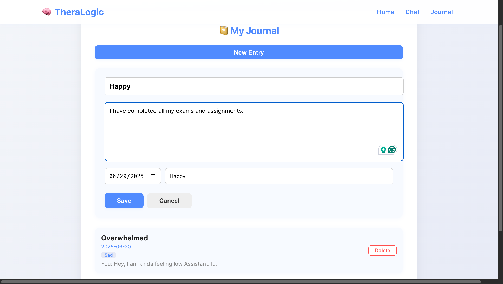

# TheraLogic Chatbot

TheraLogic is a modern, AI-powered journaling companion and chatbot. It helps you reflect, chat, and grow—combining empathetic support with logical answers, all in a beautiful, privacy-first web app.

---

## ✨ Features

- **AI-Powered Journaling:** Chat with an empathetic AI and save conversations as journal entries.
- **Emotional & Logical Routing:** Messages are classified and routed to either a therapist-style or logical assistant.
- **Modern, Responsive UI:** Beautiful landing page, onboarding tour, chat, and journal dashboard. Fully mobile-friendly.
- **Onboarding Tour:** New users are guided with a step-by-step modal tour (shows only once per device).
- **Local-First Privacy:** All journal data is stored in your browser (localStorage). Nothing leaves your device.
- **Streaks & Progress:** Visualize your journaling streak and progress over time.

---

## 🛠️ Tech Stack

- **Frontend:** React
- **Backend:** Flask, LangChain, LangGraph, Ollama (local LLM)
- **LLM:** Local model via Ollama (e.g., Llama 3)

---

## 📸 Screenshots

### Onboarding Tour


### Home Page


### Chat - Conversation Example 1


### Chat - Conversation Example 2


### Journal Page


---

## ⚡ Setup & Usage

### 1. Backend (Flask + Ollama)

1. **Install Python dependencies:**
   ```bash
   pip install -r requirements.txt
   ```
2. **Start the backend server:**
   ```bash
   python backend.py
   ```
   - The backend runs on `http://localhost:5050` by default.
   - Make sure Ollama is running locally with your chosen model (e.g., `ollama run llama3`)

### 2. Frontend (React)

1. **Install dependencies:**
   ```bash
   cd theralogic-frontend
   npm install
   ```
2. **Start the React app:**
   ```bash
   npm start
   ```
   - The frontend runs on `http://localhost:3000`

---

## 🧠 How It Works

- **Message Flow:**
  1. User sends a message in chat.
  2. Backend classifies it as "emotional" or "logical" using an LLM.
  3. The message is routed to either a therapist-style or logical agent.
  4. The response is returned and can be saved as a journal entry.

- **Journaling:**
  - All journal entries are stored in your browser (localStorage).
  - The Journal page lets you view, edit, and search your entries.

- **Onboarding:**
  - New users see a onboarding tour on first visit.

---

Ready to reflect, chat, and grow? 🚀


